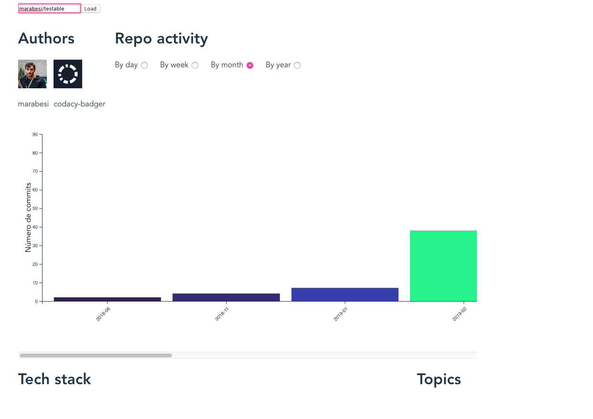
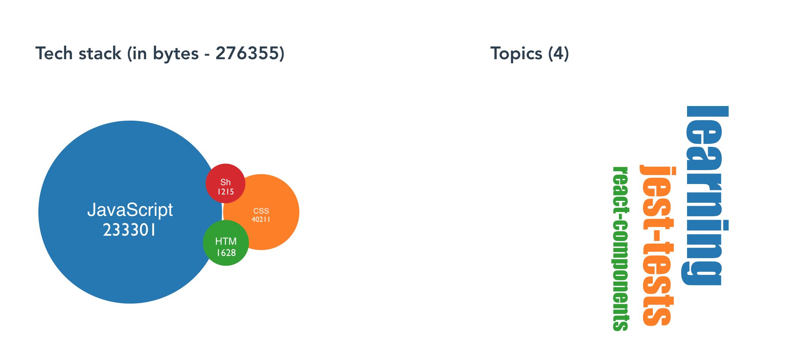

[](https://app.codacy.com/gh/marabesi/github-stats-dashboard?utm_source=github.com&utm_medium=referral&utm_content=marabesi/github-stats-dashboard&utm_campaign=Badge_Grade_Settings)
[](https://coveralls.io/github/marabesi/github-stats-dashboard?branch=master)

# Github stats dashboard





## Project setup
```
yarn install
```

### Compiles and hot-reloads for development
```
yarn run serve
```

### Compiles and minifies for production
```
yarn run build
```

### Run your tests
```
yarn run test
```

### Lints and fixes files
```
yarn run lint
```

### Customize configuration
See [Configuration Reference](https://cli.vuejs.org/config/).
