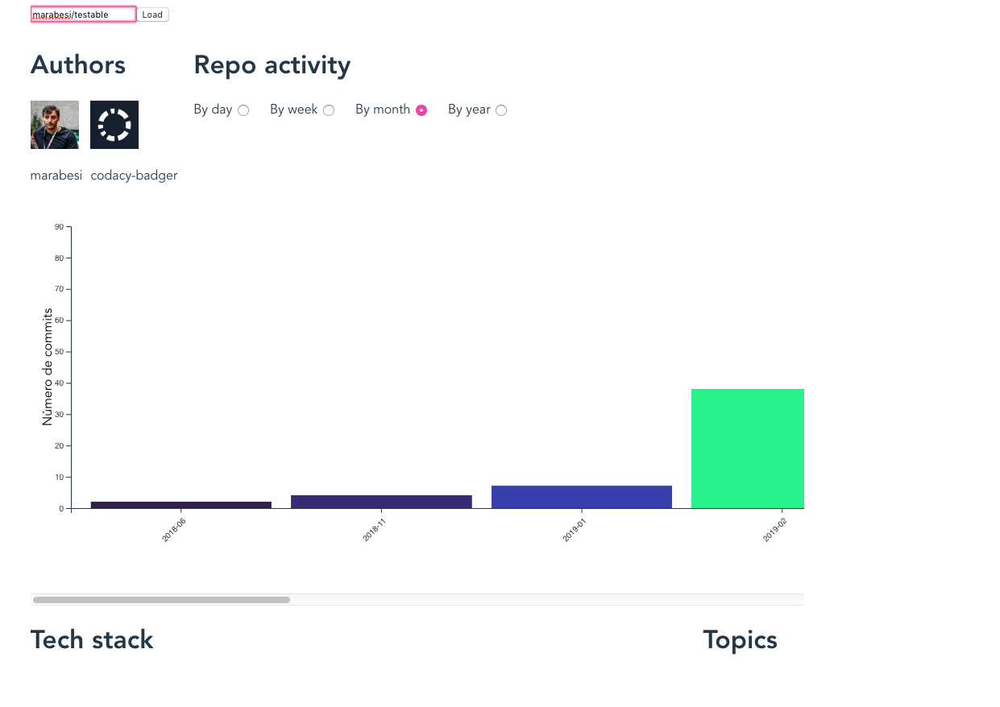
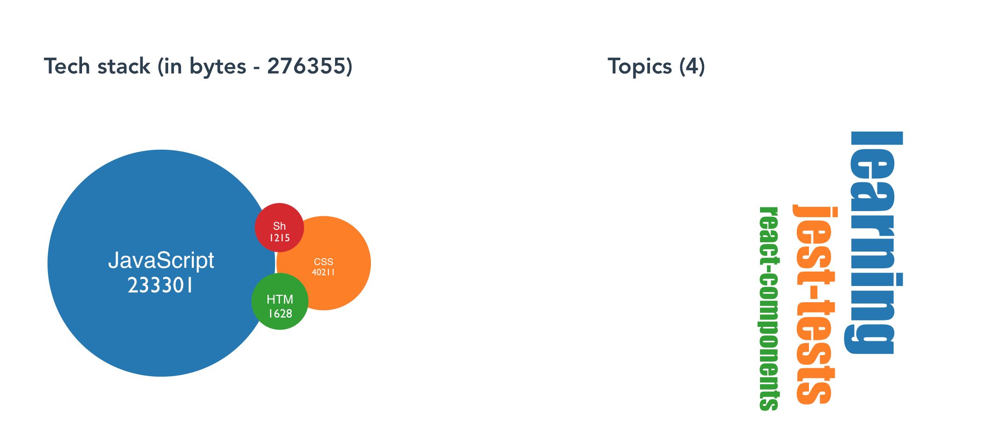

# Github stats dashboard

## Related resources

- [Adventures on vue.js and data visualization - episode 1](https://marabesi.com/web/2021/11/22/adventures-on-vuejs-and-data-visualization)
- [Adventures on vue.js and data visualization - episode 2](https://marabesi.com/web/2022/01/16/adventures-on-vuejs-and-data-visualization-ep2)
